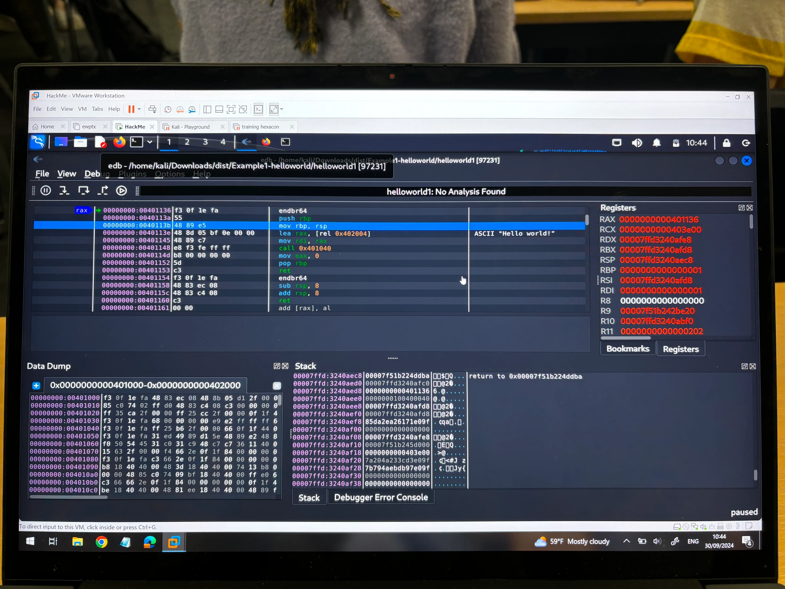

 
Back in September 2024, I went to Hexacon. This is a security conference organized by Synacktiv, mostly focused on reverse engineering and vulnerability researching.
This year’s sponsors were, but not limited to:

DFSec
Magnet Forensics
Binary Gecko
Direction Générale de la Sécurité Extérieure
Cellebrite
…
This is the time when major companies and independent security researchers present their discoveries, whether from this year or the previous one. Some highlight their victories at Pwn2Own, like Synacktiv’s successful exploitation of a Tesla by chaining multiple vulnerabilities, including one in the tire pressure monitoring system, or Google TAG’s security researcher sharing insights on exploits caught in the wild. Another researcher shared how they reverse-engineered an old game to develop cheats.

A playlist containing all the presentations from Hexacon 2024 can be found here.

# Under the hood
Trainings are usually held a few days before the conference. This is where you can follow trainings such as Android Kernel security, Hypervisor development for security analysis, Advanced Active Directory and Azure exploitation, etc…

This is where blackhoodie comes in.

Blackhoodie is an organiziation that was orginially started by Pinkflawd, a malware analysis and security expert. This training was free and ran for 4 days. Each training day was given by a security expert and focused on learning reverse engineering, techniques to exploit, or perform analysis on binaries or applications.

## Day 1
The first day was organized by Juliette and Jessica, specialized in binary reverse engineering and coming from ANSSI (French National Cybersecurity Agency).

This workshop introduced Intel x86-64 assembly by debugging and disassembling small snippets of code. This training aimed to teach us the basics of reverse engineering by understanding how compiled code is rendered in assembly and how to write a small assembly program.

## Day 2 & 3
The following two days were given by trainer and security research expert Jiska.

On the first day, we started with a malware analysis exercise. The training started with an introduction to the fundamentals of reverse engineering Android applications. We then proceeded to look into an Android app which masqueraded as an Instant Messenger, but contained a malicious functionality. The goal was to figure out which kind of sensitive information the application was leaking.

On the second day, we focused on reversing an iOS app, which included an App Extension and a mix of various programming languages. After exploring the application’s basic functionality, we learned how to make a threat model prior to security testing. Based on that, we had to find and trigger a bug in the application using tools such as frida to write javascript hooks.

## Day 4
Eloïse from Quarkslab introduced us to firmware analysis. The training focused on the discovery of two major steps of the analysis workflow which is also the most firmware specific ones: extraction of the filesystem and its cartography.

## My experience
I arrived the first day, and I was greeted by Caroline (from Synacktiv) who was in charge of organizing this year’s Blackhoodie training at Hexacon.

This was an experience like no other, surrounded by women who are experts in their fields. I learned a lot, learned about myself, learned that I also can do this, and learned that although I have solid background in pentesting, reverse engineering is an entirely different world. But however, this motivated me to continue, and in any spare time I can find, I try to enhance my skills in this field.

## More on Blackhoodie
From Blackhoodie’s mission page:

Blackhoodie mission:
BlackHoodie is a series of technical trainings aiming to attract more women to the field of cyber security
Our events are women-only, except if individual organizers state otherwise
Whether introduction level or advanced, classes are always challenging
All of our events are free to attend
We do not exert any preference in education level, occupation or corporate affiliation of attendees
BlackHoodie is dedicated to serve the community, we aim to integrate, not separate
BlackHoodie is independent, and cannot be leveraged to promote anything but its own mission
We seek quality over quantity, in number of classes and attendees
We also support/encourage attendees to start giving technical trainings thereby providing a platform to build their confidence
Thank you for reading, and a big thanks to the Blackhoodie community for organizing this amazing training. ❤
